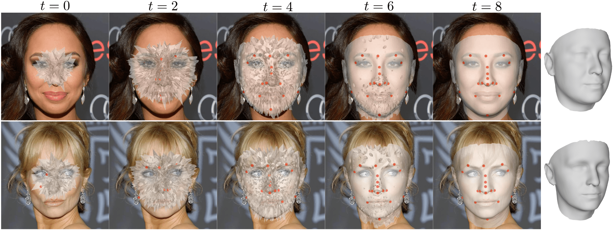
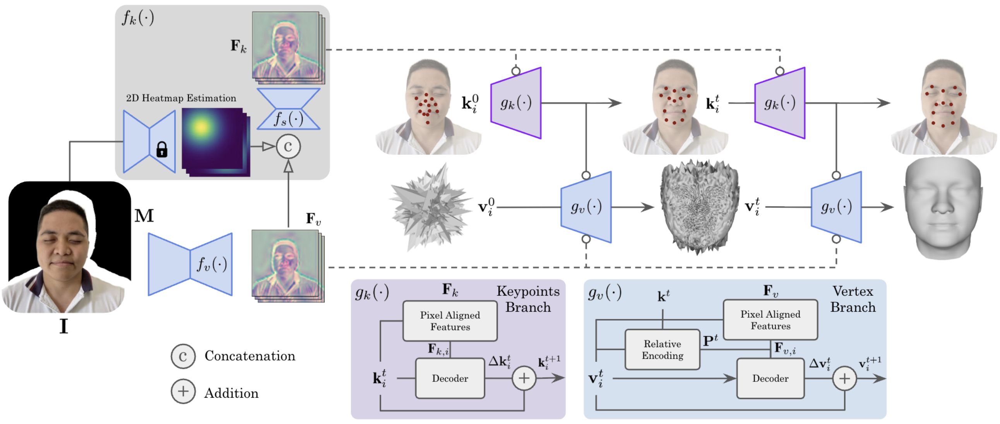

## Abstract

Existing 3D face modeling methods usually depend on 3D Morphable Models, which inherently constrain the representation capacity to fixed shape priors. Optimization-based approaches offer high-quality reconstructions but tend to be computationally expensive. In this work, we introduce GLVD, a hybrid method for 3D face reconstruction from few-shot images that extends Learned Vertex Descent (LVD) by integrating per-vertex neural field optimization with global structural guidance from dynamically predicted 3D keypoints. By incorporating relative spatial encoding, GLVD iteratively refines mesh vertices without requiring dense 3D supervision. This enables expressive and adaptable geometry reconstruction while maintaining computational efficiency. GLVD achieves state-of-the-art performance in single-view settings and remains highly competitive in multi-view scenarios, all while substantially reducing inference time.

## Method

We introduce GLVD, a learning-based optimization approach that fuses local and global cues by combining per-vertex neural fields with dynamically predicted 3D keypoints. Each neural field predicts 3D displacements for its associated vertex based on local features sampled at its current position, while the keypoint ensemble provides global structural guidance that informs and regularizes the optimization process. Central to our method is a relative encoding scheme, where each vertex is transformed based on the current keypoint estimates, allowing the network to learn geometry-aware updates that are conditioned on the evolving global structure.



We aim to incorporate global 3D-aware guidance into the per-vertex optimization by leveraging a relative encoding based on the Euclidean distances between vertices and keypoints. As a result, we propose a two-stage architecture to address limited multi-view input images: (1) a 3D keypoint estimation module that defines spatial keypoints on the facial surface by estimating displacements, and (2) a vertex prediction module that encodes vertices relative to these keypoints to estimate vertex updates. Our formulation does not rely on a predefined parametric model or fixed joint sets, making it adaptable to arbitrary topologies. A sparse set of surface points is conveniently selected to act as ground-truth keypoints.


## Results

We conducted a comprehensive comparison of our method with several 3DMM-based reconstruction works, including MVFNet, DFNRMVS, DECA, MICA, FaceScape, FaceVerse, HRN and 3DDFA-v3. Additionally, we compared our approach to the model-free methods PIFU, JIFF, RAFaRe, H3D-Net, SIRA++ and hybrid method LVD.

GLVD demonstrates consistently strong performance across 3DFAW and H3DS evaluations. It leverages the structured topology of 3DMMs while explicitly addressing the constraint of shape representation to a predefined model space and the resulting bias toward average mean shape. As a result, GLVD outperforms 3DMM-based approaches, particularly in the single-view setting. In comparison to model-free single forward pass methods such as PIFU, JIFF and RAFaRe, it demonstrates superior performance in surface reconstruction, yielding surfaces with reduced errors and a more realistic shape appearance. 

<p align="center">
  <video controls width="800">
    <source src="assets/videos/results.webm" type="video/webm">
  </video>
</p>

Optimization-based methods are considered state-of-the-art for face reconstruction, particularly in multi-view settings where the problem becomes less ill-posed. However, their high computational cost remains a key limitation. In contrast, GLVD achieves comparable accuracy with over two orders of magnitude faster inference and without requiring postprocessing or template registration. Inference times are reported in with 10 iterative update steps.


## BibTeX

```
@article{rico2025glvd,
  title={GLVD: Guided Learned Vertex Descent},
  author={Rico, Pol Caselles and Noguer, Francesc Moreno},
  journal={arXiv preprint arXiv:2510.06046},
  year={2025}
}
```